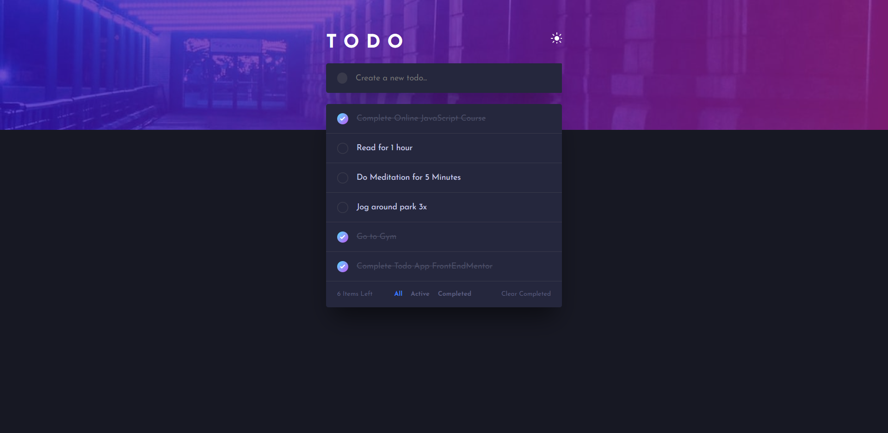
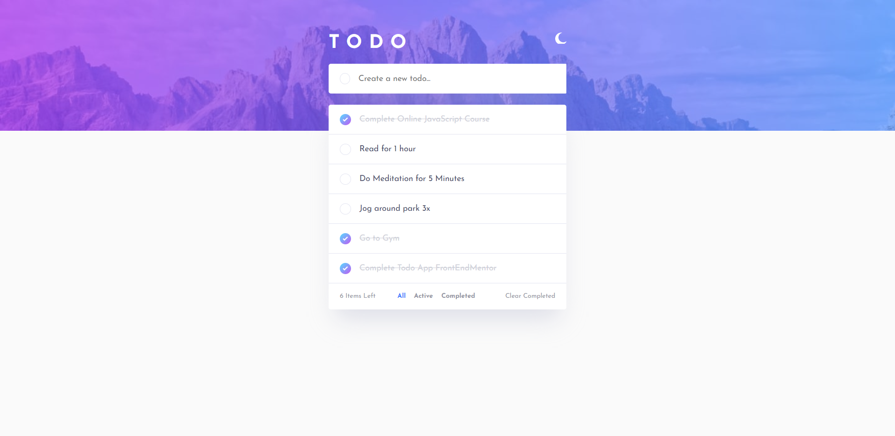
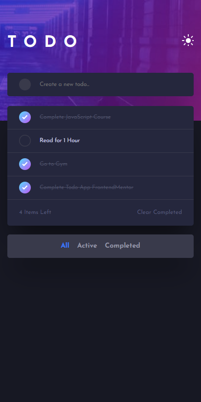
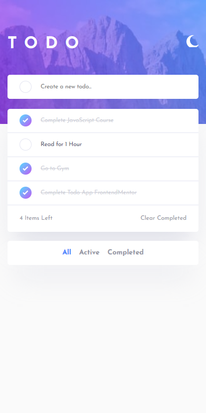

# Frontend Mentor - Todo app solution

This is a solution to the [Todo app challenge on Frontend Mentor](https://www.frontendmentor.io/challenges/todo-app-Su1_KokOW). Frontend Mentor challenges help you improve your coding skills by building realistic projects.

## Table of contents

- [Overview](#overview)
  - [The challenge](#the-challenge)
  - [Screenshot](#screenshot)
  - [Links](#links)
- [My process](#my-process)
  - [Built with](#built-with)
  - [What I learned](#what-i-learned)
  - [Continued development](#continued-development)
- [Author](#author)

## Overview

### The challenge

Users should be able to:

- View the optimal layout for the app depending on their device's screen size
- See hover states for all interactive elements on the page
- Add new todos to the list
- Mark todos as complete
- Delete todos from the list
- Filter by all/active/complete todos
- Clear all completed todos
- Toggle light and dark mode
- **Bonus**: Drag and drop to reorder items on the list

### Screenshot

## Desktop

## Mobile

### Links

- Solution URL: [ solution URL here](https://github.com/Faraz-mobin17/Todo-App)
- Live Site URL: [ live site URL here](https://gallant-wright-a48ad5.netlify.app/)

## My process

### Built with

- Semantic HTML5 markup
- CSS custom properties
- Flexbox
- Mobile-first workflow
- Vanilla JavaScript

### What I learned

learned alot from this project

- how to toggle between dark mode and light mode
- learned usage of data-\* attribute in html and javascript
- building todolist on my own for the first time gave me confidence

### Continued development

Drag and Drop features coming soon..

## Author

- Website - [Faraz Mobin](https://github.com/Faraz-mobin17/)
- Frontend Mentor - [@Faraz-mobin17](https://www.frontendmentor.io/profile/Faraz-mobin17)
- Twitter - [@Faraz_mobin](https://twitter.com/Faraz_mobin)
